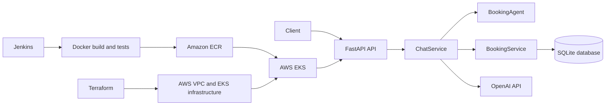

# Cloud-Native AI Receptionist

A FastAPI-based AI receptionist backend for conversational appointment management. Users can chat with the receptionist, create and view appointments, update bookings, cancel appointments, and receive general AI-powered responses through OpenAI.

The application runs locally with SQLite and can be containerized and deployed to AWS EKS using Kubernetes, Terraform, Amazon ECR, and Jenkins.

## Features

- Conversational receptionist endpoint powered by OpenAI.
- Appointment creation, listing, updating, and cancellation.
- Duplicate appointment and time-slot conflict checks.
- Health-check endpoint for service monitoring.
- Automatic SQLite database initialization through SQLAlchemy.
- Docker image for local and CI execution.
- Pytest API and appointment lifecycle tests.
- Terraform configuration for AWS VPC, EKS, IAM, and worker nodes.
- Kubernetes namespace, deployment, and LoadBalancer service manifests.
- Jenkins pipeline for build, test, ECR push, and EKS deployment.

## Architecture



### Request flow

- HTTP requests enter through `backend/app/api/routes.py`.
- `ChatService` handles conversational state and delegates booking operations to `BookingService`.
- `BookingAgent` performs keyword-based intent detection and extracts booking, update, and cancellation details.
- Messages that do not match supported booking intents are passed to `AIService`, which calls OpenAI.
- Appointment records are stored in SQLite through SQLAlchemy.

## Technology Stack

- Python 3.14
- FastAPI and Uvicorn
- Pydantic
- SQLAlchemy
- SQLite
- OpenAI API
- Docker
- Kubernetes and AWS EKS
- Terraform
- Jenkins
- Pytest

## Repository Structure

```text
backend/
  app/
    main.py                 FastAPI application entry point
    config.py               Environment-based application settings
    api/routes.py           HTTP endpoints
    ai/                     OpenAI client and booking intent extraction
    core/                   Logging and exception handling
    database/               SQLAlchemy session and appointment model
    prompts/                Receptionist system prompt
    schemas/                Pydantic request and response models
    services/               Chat, AI, conversation, and booking services
  tests/test_main.py        API and appointment lifecycle tests
  Dockerfile                Application container definition
  requirements.txt          Python dependencies
  .env.example              Environment variable template

k8s/
  namespace.yml             Kubernetes namespace
  deployment.yml            Application deployment
  service.yml               Public LoadBalancer service

terraform/eks/
  vpc.tf                    VPC, subnets, routes, and internet gateway
  eks.tf                    EKS cluster resources
  nodegroup.tf              EKS worker node group
  iam.tf                    IAM roles and policies
  variables.tf              Terraform variables
  terraform.tfvars          Deployment-specific values
  outputs.tf                Terraform outputs

Jenkinsfile                 CI/CD pipeline definition
```

## Prerequisites

For local development:

- Python 3.14 or a compatible Python version
- `pip`
- Docker, if using the container workflow
- An OpenAI API key for AI responses

For AWS deployment:

- An AWS account with permission to manage EKS, EC2, IAM, VPC, and ECR resources
- AWS CLI configured with credentials
- Terraform
- `kubectl`
- A Jenkins agent with Docker, AWS CLI, and `kubectl` installed for the CI/CD workflow

## Configuration

Copy the example environment file before starting the backend:

```bash
cd backend
cp .env.example .env
```

Set the following values in `backend/.env`:

```dotenv
OPENAI_API_KEY=your_openai_api_key
APP_NAME=AI Receptionist API
APP_VERSION=1.0.0
HOST=127.0.0.1
PORT=8000
```

`OPENAI_API_KEY` is required for general AI responses. Do not commit `.env` files or API keys to the repository.

## Run Locally

```bash
git clone https://github.com/CdWithChandra/ai-receptionist.git
cd ai-receptionist

python -m venv .venv
source .venv/bin/activate
# Windows PowerShell: .venv\Scripts\Activate.ps1

pip install -r backend/requirements.txt
cp backend/.env.example backend/.env

uvicorn app.main:app --app-dir backend --reload
```

The API will be available at:

- API root: <http://127.0.0.1:8000/>
- Health check: <http://127.0.0.1:8000/health>
- Interactive Swagger documentation: <http://127.0.0.1:8000/docs>
- ReDoc documentation: <http://127.0.0.1:8000/redoc>

The local SQLite database is created as `backend/ai_receptionist.db` when the application starts.

## API Endpoints

| Method | Endpoint | Description |
| --- | --- | --- |
| `GET` | `/` | Returns a welcome message. |
| `GET` | `/health` | Returns service health and application version. |
| `POST` | `/chat` | Sends a message to the AI receptionist. |
| `POST` | `/booking` | Creates an appointment. |
| `GET` | `/appointments` | Lists all appointments. |
| `PUT` | `/booking/{appointment_id}` | Updates an appointment. |
| `DELETE` | `/booking/{appointment_id}` | Deletes an appointment. |

### Chat request

```bash
curl -X POST http://127.0.0.1:8000/chat \
  -H "Content-Type: application/json" \
  -d '{"message":"I want to book an appointment"}'
```

Example response:

```json
{
  "reply": "Sure! What's the customer's name?"
}
```

### Create an appointment

```bash
curl -X POST http://127.0.0.1:8000/booking \
  -H "Content-Type: application/json" \
  -d '{
    "customer_name": "Chandra",
    "appointment_date": "2099-12-31",
    "appointment_time": "11:59 PM"
  }'
```

Example response:

```json
{
  "status": "success",
  "message": "Appointment booked successfully for Chandra on 2099-12-31 at 11:59 PM"
}
```

### Update an appointment

```bash
curl -X PUT http://127.0.0.1:8000/booking/1 \
  -H "Content-Type: application/json" \
  -d '{
    "customer_name": "Chandra",
    "appointment_date": "2099-12-31",
    "appointment_time": "12:30 PM"
  }'
```

### Delete an appointment

```bash
curl -X DELETE http://127.0.0.1:8000/booking/1
```

The interactive API documentation at `/docs` is the authoritative source for request validation and response schemas.

## Run Tests

From the repository root:

```bash
python -m pytest backend/tests -q
```

Or from the backend directory:

```bash
cd backend
python -m pytest tests -q
```

The test suite covers the root and health endpoints, appointment CRUD behavior, validation errors, and nonexistent appointment handling.

## Docker

Build the image from the repository root:

```bash
docker build -t ai-receptionist backend
```

Run the API using the local environment file:

```bash
docker run --rm \
  -p 8000:8000 \
  --env-file backend/.env \
  ai-receptionist
```

Run the tests inside the container:

```bash
docker run --rm ai-receptionist python -m pytest tests -q
```

## AWS and Terraform Deployment

The Terraform configuration is in `terraform/eks` and currently targets:

- AWS region: `ap-south-1`
- EKS cluster: `ai-receptionist-eks`
- VPC CIDR: `10.0.0.0/16`
- Node instance type: `m7i-flex.large`
- Desired nodes: `2`
- Minimum nodes: `1`
- Maximum nodes: `3`

Configure AWS credentials before running Terraform. Review `terraform.tfvars` and adjust values for your environment.

```bash
cd terraform/eks
terraform init
terraform validate
terraform plan
terraform apply
```

Do not commit Terraform state files, plans, or cloud credentials. The repository `.gitignore` excludes common Terraform state and working-directory files.

## Kubernetes Deployment

The Kubernetes manifests use the `ai-receptionist` namespace and expose the application through a public AWS LoadBalancer service.

Configure `kubectl` for the cluster:

```bash
aws eks update-kubeconfig \
  --region ap-south-1 \
  --name ai-receptionist-eks
```

Apply the manifests:

```bash
kubectl apply -f k8s/namespace.yml
kubectl apply -f k8s/deployment.yml
kubectl apply -f k8s/service.yml
```

Inspect the deployment:

```bash
kubectl -n ai-receptionist get deployment
kubectl -n ai-receptionist get pods
kubectl -n ai-receptionist get service
kubectl -n ai-receptionist rollout status deployment/ai-receptionist
```

The Jenkins pipeline replaces the deployment image with the build-specific ECR image using `kubectl set image` and waits up to 180 seconds for the rollout to complete.

## CI/CD Pipeline

`Jenkinsfile` defines the following stages:

1. Checkout the source code.
2. Verify required backend and Kubernetes files.
3. Build the Docker image using the Jenkins build number as the image tag.
4. Run Pytest inside the built image.
5. Authenticate with Amazon ECR.
6. Push the image to:
   `669294688092.dkr.ecr.ap-south-1.amazonaws.com/ai-receptionist`.
7. Update the EKS kubeconfig and verify cluster access.
8. Update the Kubernetes deployment image.
9. Wait for and verify the rollout.
10. Remove local Docker images in the post-build cleanup step.

The pipeline performs a rolling Kubernetes deployment. It is not a blue-green deployment.

## Known Limitations and Security Notes

- The API does not currently implement authentication or authorization.
- The Kubernetes service is a public `LoadBalancer`; restrict access before using it for sensitive workloads.
- The default persistence layer is a local SQLite file. SQLite is suitable for development but should be replaced with a managed database for multi-replica production deployments.
- Conversation state is managed in process, so it is not shared between replicas or preserved across restarts.
- `BookingAgent` uses keyword matching and regular expressions for intent and data extraction; it does not provide unrestricted natural-language scheduling.
- Booking dates and times must use the formats expected by the API, such as `YYYY-MM-DD` and `10:30 AM`.
- The OpenAI API key must be stored in an environment variable or a managed secret, never in source control.
- The Kubernetes deployment manifest contains an image reference for the AWS account and region used by this project. Update it for another registry or account.
- Terraform creates AWS infrastructure that may incur charges. Review the plan before applying it.

## Cleanup

Destroy Terraform-managed infrastructure when it is no longer needed:

```bash
cd terraform/eks
terraform destroy
```

The Jenkins post-build step also removes the temporary Docker image and prunes unused Docker images from the Jenkins agent.

## Project Status

The current implementation provides a functional FastAPI backend, appointment workflow, OpenAI integration, automated tests, Docker packaging, and AWS deployment configuration. Production hardening—especially authentication, persistent shared storage, secret management, observability, and stronger intent validation—should be completed before exposing the service to untrusted users.

## License

No license file is currently included. Add a license before distributing or accepting external contributions.
